# Namecheap DDNS Updater Web UI

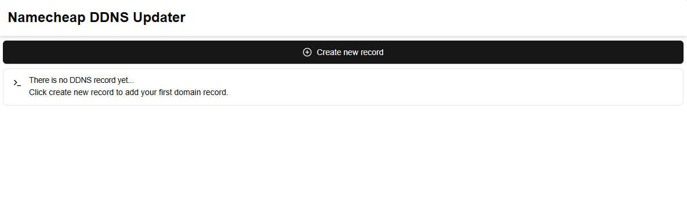

Namecheap DDNS updater is an UI tool for the purpose of dynamically updating DNS A record from Namecheap with the current public IP of host machine. In this guide, we will show you on how to install, create A record on Namecheap, and insert the record to DDNS updater tool.

## Dear Recruiters... (Before we begin)

This project is one part of my portfolio for applying developer jobs. If you are interested in skillset I'm presenting inside this project, please feel free to reach me via [LinkedIn](https://www.linkedin.com/in/tharathep-k-64194894/).

Skill used in this project:

- Backend: .NET 8, C#, dependency injection, repository pattern, EF migration, Quartz Cron Job
- Frontend: NextJS
- Database: Postgresql
- Platform: Docker

## Getting Started

In this section, we will show you how to install, create Namecheap A record, and maintain the record into DDNS updater. Please follow the steps for running the program.

1. Install [Git](https://git-scm.com/downloads)
2. Install [Docker](https://www.docker.com/products/docker-desktop/)
3. Open Terminal or Powershell and type the following command to clone this project to your machine.
```
git clone https://github.com/RealFilllykung/namecheap-ddns-updater-web-ui.git
```
4. Run the following command
```
docker-compose up -d
```
5. Access the website via your prefer internet browser by visiting this URL
```
http://localhost:3000
```

You should be able to see the web page that looks something like this

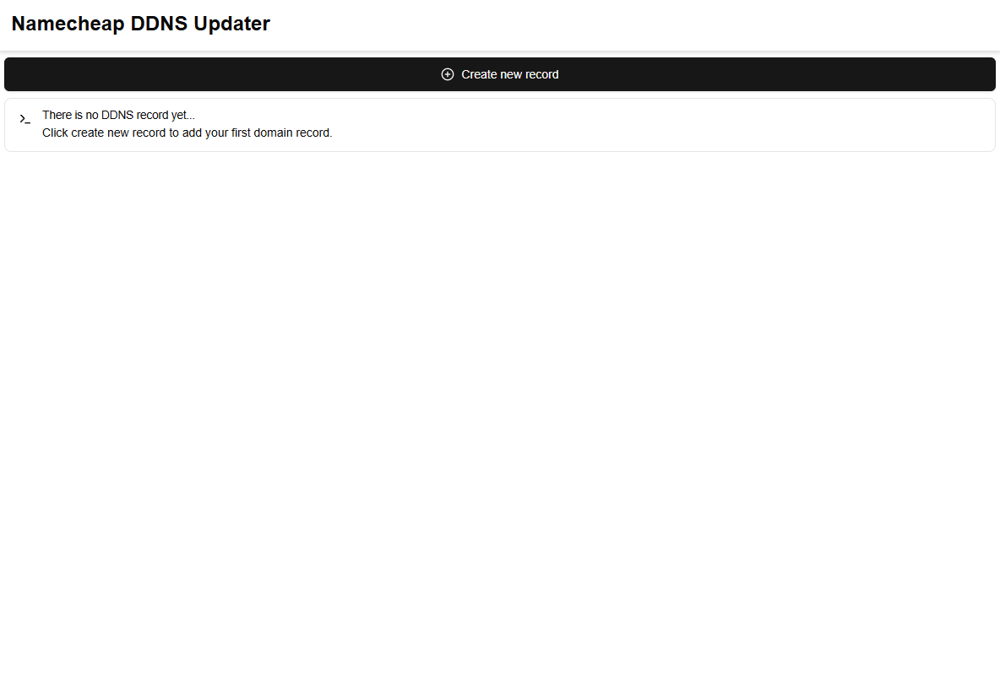

6. Login to Namecheap and visit account page

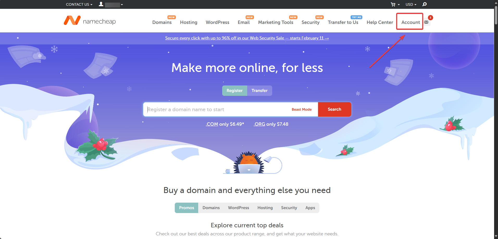

7. Click on manage your domain

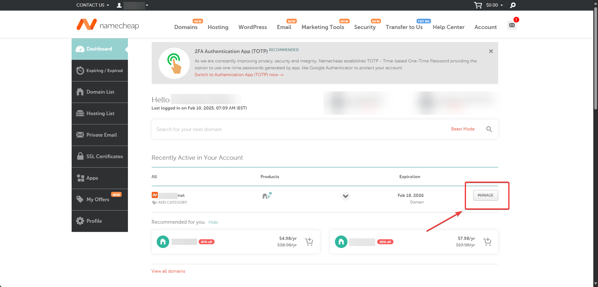

8. Click on advance DNS

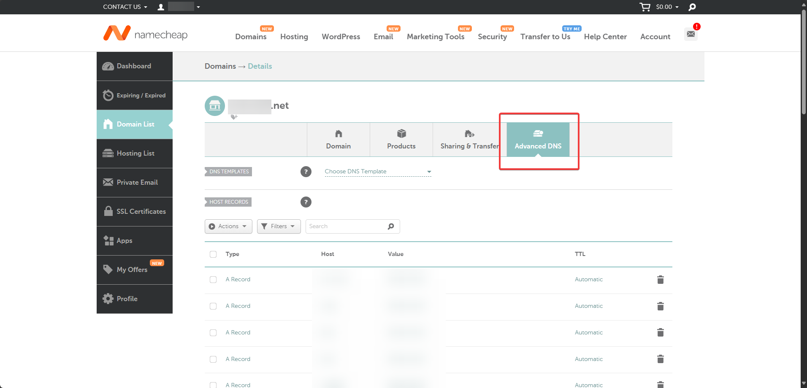

9. Click add new record

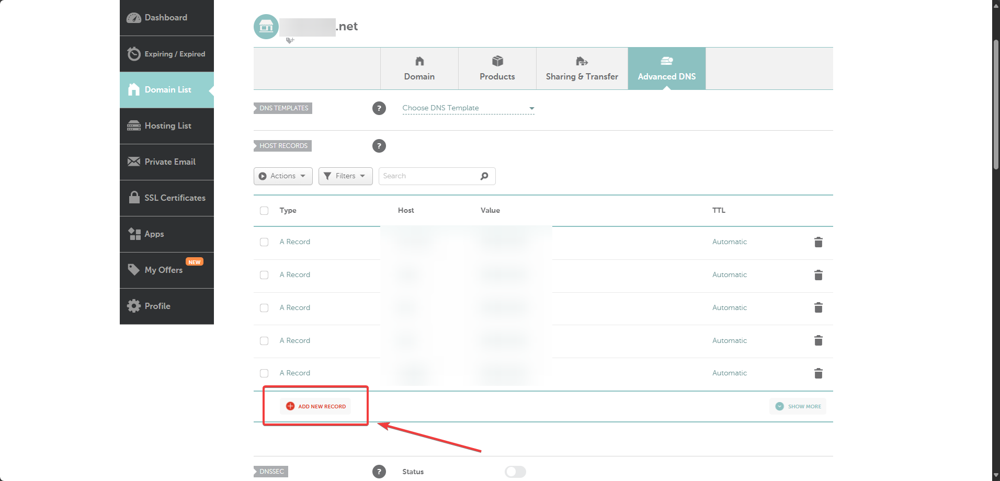

10. Fill in your new domain record and press save. For this case, I will be creating testddns3.your-domain.net

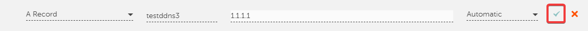

11. Enable dynamic DNS and copy the password

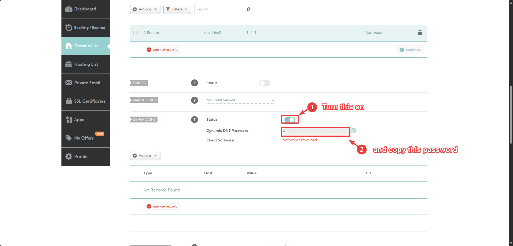

12. Go back to DDNS updater website and press add new domain name

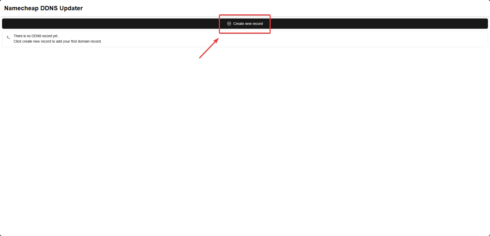

13. Fill in your previously created domain and insert the password. Then press save to create new record.

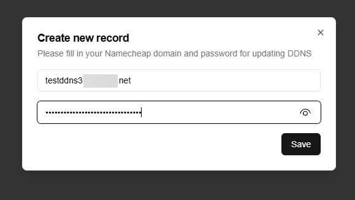

After you press save, the system will create new record and appear into your webpage once it is finished creating new record.

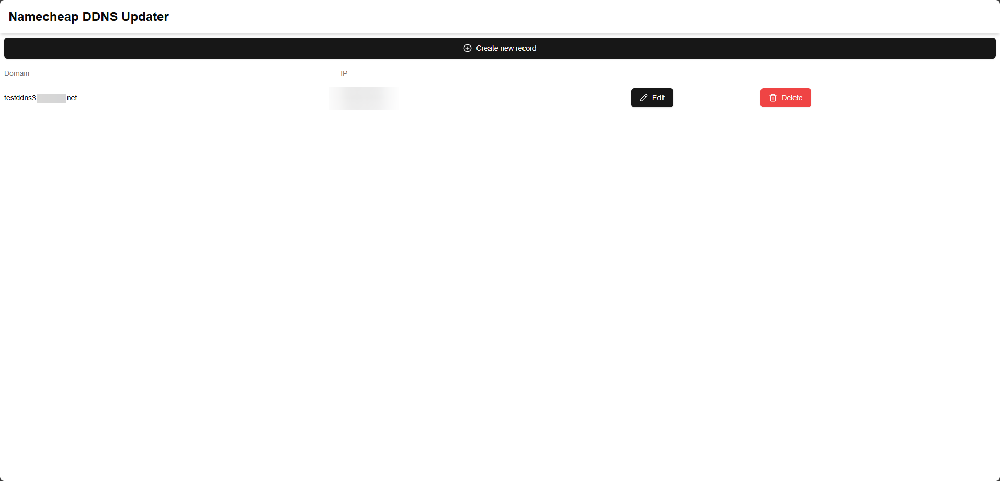

## Development Project Setup

Here are the development project setup in case you want to further develop this project. We will be discussing about the tools and how to run the development environment.

### Recommend Development Tools

Here are the tools I used to develop this project.

- Frontend: VS Code
- Backend: JetBrains Rider

### Backend

For testing the backend, please use the following command to run backend Docker compose.

```
docker-compose up -f docker-compose-development-backend.yaml
```

You can freely close any Docker container in case you want to run the backend on your host machine.

For .NET project, please change your terminal directory to the project and run the following command to run the project.

```
dotnet restore \
dotnet run .
```

### Frontend

For testing the frontend, please use the following command to run backend development environment.

```
docker-compose up -f docker-compose-development-frontend.yaml
```

After you already run backend, please use the following command to run the frontend.

```
cd \
npm install \
npm run dev
```

## Technical Specification

Before we move on, if you want to investigate my design decision, please feel free to access `design-decision` folder. In those folder will contains bunch of questions and decision that I have used for making this project.

The current version of design will follow the following system design architecture.

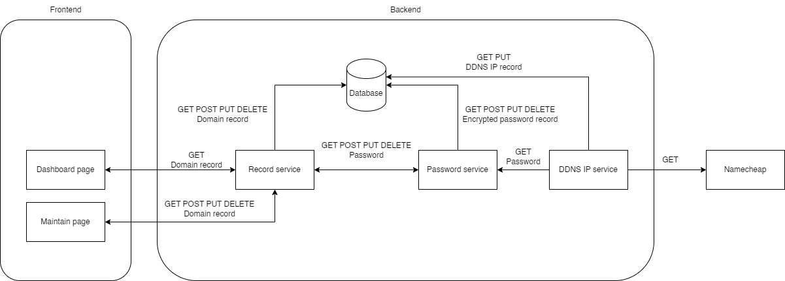